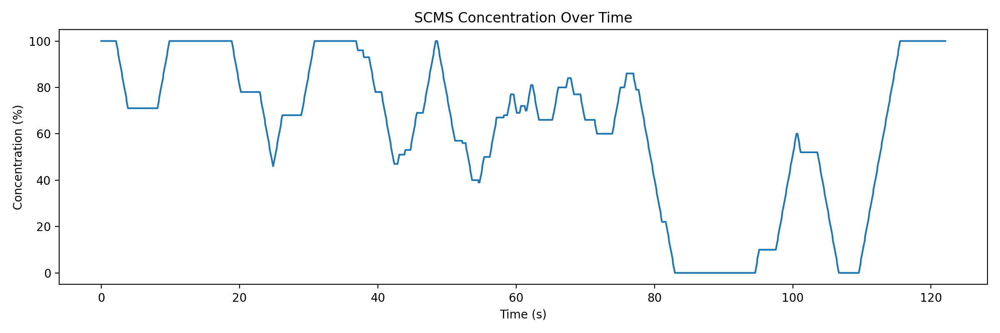

# scms_gui_v2

### 1. **Student Concentration Monitoring System (SCMS)**
# 🧠 Student Concentration Monitoring System (SCMS) — Flask + OpenCV

SCMS is a real-time student attention monitoring system designed for online learning and self-study sessions.  
It runs locally using a standard webcam and provides a live dashboard showing:

- Attention state (Attentive / Distracted / No Face)
- Concentration score over time
- Gaze direction (Center / Left / Right)
- Head pose angles (Yaw / Pitch / Roll)
- Fatigue detection using EAR (Eye Aspect Ratio)
- Session logging to CSV and visual analysis plots

> ✅ This repository contains the **working GUI demo** used in the graduation project presentation and discussion.
This project uses computer vision and machine learning to track and analyze a student's eye activity and facial orientation to estimate attention span during online classes or work sessions.

## 📌 Features
- Real-time webcam input using OpenCV
- Face and eye detection using Dlib
- Alert system for inattention
- Custom ML model for attention classification

## 🛠 Tech Stack
- Python
- OpenCV
- Dlib
- Scikit-learn
- NumPy


## 🚀 How to Run
```bash
pip install -r requirements.txt
python app.py
```

---

## Demo Screenshots

### Dashboard — Attentive


### Dashboard — Distracted


### Concentration Over Time


### Attention State Timeline


---

## System Pipeline (Overview)

1. Webcam capture using OpenCV  
2. Face detection (OpenCV)  
3. Facial landmark detection using **OpenCV Facemark LBF**  
4. Head pose estimation (Yaw, Pitch, Roll) using solvePnP  
5. Gaze estimation from eye landmarks  
6. Fatigue detection using Eye Aspect Ratio (EAR)  
7. User-specific **calibration** to reduce bias  
8. Rule-based attention decision logic with temporal smoothing  
9. CSV logging and post-session visualization

---

## Requirements

- Python 3.9 or newer
- A working webcam
- OpenCV **contrib** build (required for `cv2.face` / Facemark LBF)

---

## Model File (Important)

This project uses an OpenCV Facemark LBF model file:

- `lbfmodel.yaml`

⚠️ The model file is **not included** in this repository due to licensing considerations.

Please download it separately and place it in the **same directory as `app.py`**.

Your `.gitignore` already prevents this file from being uploaded.

---

## Installation (Windows PowerShell)

### 1) Create and activate a virtual environment
```powershell
cd path\to\scms_gui_v2
py -m venv .venv
.\.venv\Scripts\Activate.ps1
python -m pip install --upgrade pip
```
### 2) Install dependencies
```powershell
pip install -r requirements.txt
```
### 3) Run the application
```powershell
python app.py
```

Then open your browser at:
```powershell
http://127.0.0.1:5000
```

## How to Use

### Calibration
1. Sit normally and look directly at the screen  
2. Click **Calibrate**  
3. Wait until the status shows **Calibration: Done**

Calibration personalizes the system and significantly improves accuracy.

---

### Session Logging
1. Click **Start Session**
2. Perform a realistic test:
   - Look at the screen (**Attentive**)
   - Look away (**Distracted**)
   - Return to the screen
3. Click **Stop Session**

A CSV log file will be saved in:
- `logs/ `

---

## Analyze Session Logs

Generate concentration and attention state plots from a CSV log:

```powershell
python analyze_log.py .\logs\scms_session_YYYYMMDD_HHMMSS.csv
```
### This produces:

- Concentration-over-time plot
- Attention state timeline plot

---

📁 Project Structure
scms_gui_v2/
- `│`
- `├── app.py`                 # Flask app + webcam processing
- `├── analyze_log.py`       # CSV analysis and plotting
- `├── scms/`                  # Core attention logic and calibration
- `├── templates/`             # Dashboard HTML templates
- `├── static/`                # CSS and static assets
- `├── assets/screenshots/`    # README screenshots
- `├── requirements.txt`
- `├── README.md`
- `├── LICENSE`
- `└── .gitignore`


👨‍💻 Author
Yassin Aboulnour ->

